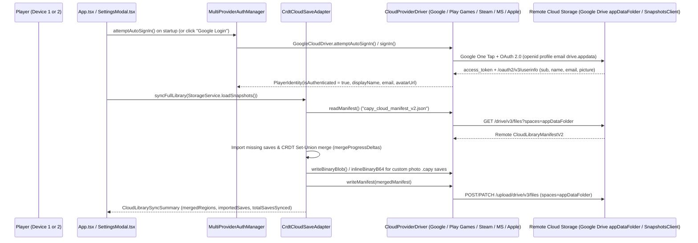
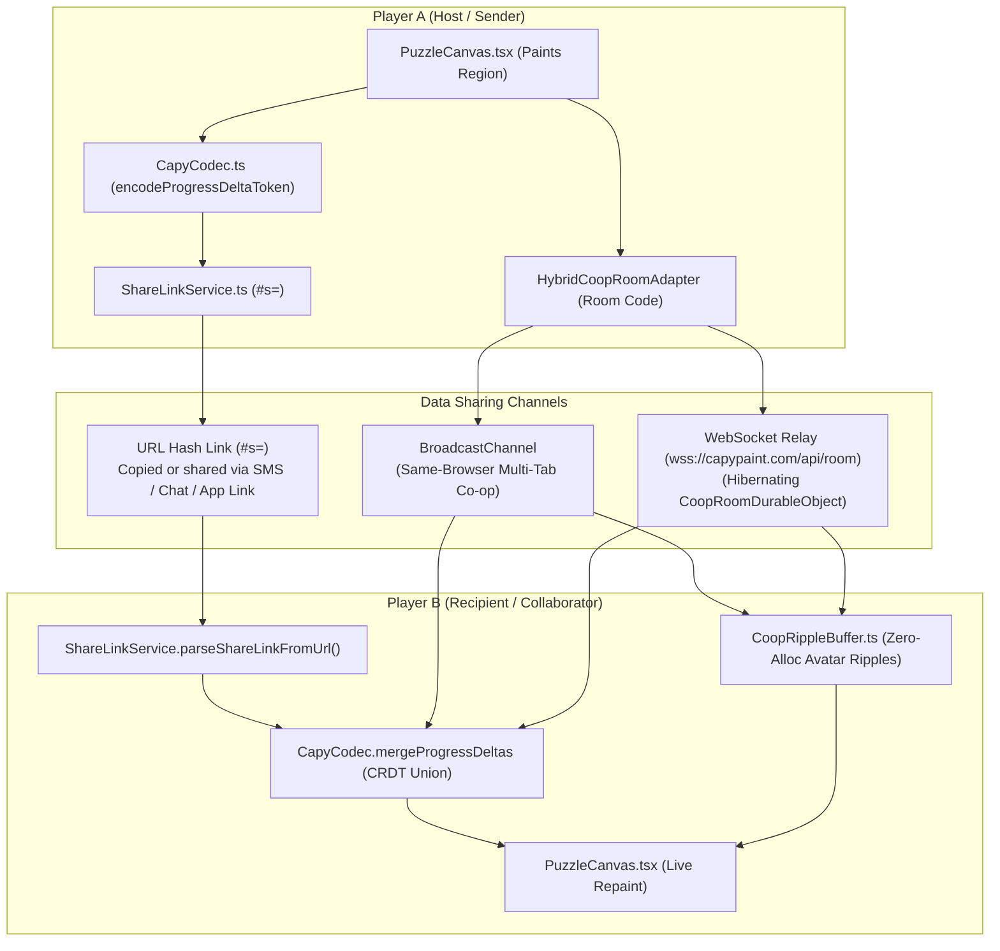

# Modular Cloud Sync, Google Account / Play Games v2 & Multiplayer Sharing (`CLOUD.md`)

This document explains how modular multi-platform cloud login (`Google`, `Google Play Games v2`, `Steam`, `Microsoft`, `Apple`), conflict-free cross-device Save Library sync, shareable progress links, simultaneous Co-op multiplayer rooms, and Cloudflare Workers edge hosting (`capypaint.com`) work across the **Capy** monorepo (`web/`, `app/`, and `worker/`).

**Related Guides**: [`README.md`](./README.md) | [`ROADMAP.md`](./ROADMAP.md) | [`DEV.md`](./DEV.md) | [`AGENTS.md`](./AGENTS.md) | [`TODO.md`](./TODO.md) | [`WEB.md`](./WEB.md) | [`PUZZLE.md`](./PUZZLE.md) | [`APP.md`](./APP.md) | [`TESTING.md`](./TESTING.md) | [`CHANGELOG.md`](./CHANGELOG.md)

**Table of Contents**:
1. [Plain-English Overview: How Everything Works](#1-plain-english-overview-how-everything-works)
2. [End-to-End Architecture Diagrams](#2-end-to-end-architecture-diagrams)
3. [Step-by-Step Developer Guide: Provisioning Google Cloud OAuth 2.0 & Play Games v2](#3-step-by-step-developer-guide-provisioning-google-cloud-oauth-20--play-games-v2)
4. [Step-by-Step Developer Guide: Deploying capypaint.com & capyboop.com on Cloudflare Workers](#4-step-by-step-developer-guide-deploying-capypaintcom-and-capyboopcom-on-cloudflare-workers)

---

## 1. Plain-English Overview: How Everything Works

### A. Modular Cloud Provider Architecture (`CloudProviderDriver`)
Capy separates **CRDT save merging** (`CrdtCloudSaveAdapter` in [`ProviderRegistry.ts`](./web/src/services/providers/ProviderRegistry.ts)) from **platform-specific authentication and cloud storage** via the modular [`CloudProviderDriver`](./web/src/services/providers/types.ts) interface implemented in [`CloudProviderDrivers.ts`](./web/src/services/providers/CloudProviderDrivers.ts):

- **`'google'` (`GoogleCloudDriver`) -- Active on Web, PWA, Desktop, iOS & Android**:
  - *Auth*: Google Identity Services OAuth 2.0 (`https://accounts.google.com/gsi/client` via [`GoogleCloudSyncClient.ts`](./web/src/services/providers/GoogleCloudSyncClient.ts), scopes `openid profile email` + app-isolated `https://www.googleapis.com/auth/drive.appdata`).
  - *Storage*: Google Drive `appDataFolder` REST API v3 (`capy_cloud_manifest_v2.json` + per-puzzle `.capy` v2 binary archives).
- **`'play_games_v2'` (`PlayGamesAndroidDriver`) -- Active on Android (`:app`)**:
  - *Auth*: Native Google Play Games Services v2 SDK (`GamesSignInClient` + `PlayersClient` in [`MainActivity.kt`](./app/src/main/java/com/capypaint/capy/MainActivity.kt)).
  - *Storage*: `PlayGames.getSnapshotsClient(activity)` Saved Games API (`RESOLUTION_POLICY_MOST_RECENTLY_MODIFIED`) paired with local `filesDir/capy_cloud/` caching and `inlineBinaryB64` custom-save embedding.
- **`'steam'` (`SteamCloudDriver`) -- Modular Driver Ready (`ICE-1` in [`ROADMAP.md`](./ROADMAP.md))**:
  - *Auth & Storage*: Steamworks Auth Session Ticket (`window.__capySteamBridge`) + `ISteamRemoteStorage` (`fileWriteAsync` / `fileReadAsync`), awaiting the Tauri desktop wrapper.
- **`'microsoft'` (`MicrosoftCloudDriver`) -- Modular Driver Ready (`ICE-3` in [`ROADMAP.md`](./ROADMAP.md))**:
  - *Auth & Storage*: Microsoft Entra ID / MSA OAuth 2.0 PKCE (`Files.ReadWrite.AppFolder`) + OneDrive `special/approot` / Xbox Connected Storage.
- **`'apple'` (`AppleCloudDriver`) -- Modular Driver Ready (`ICE-2` in [`ROADMAP.md`](./ROADMAP.md))**:
  - *Auth & Storage*: Sign in with Apple JS / Native GameKit (`GKLocalPlayer`) + CloudKit `privateCloudDatabase` / iCloud `GKSavedGame`.

### B. How Automatic Google Account & Play Games Login Works
1. **Instant Local Profile (Zero Friction)**:
   - Every player starts immediately with a local profile (for example, `Sunny Capy` with a chosen avatar color) stored in `localStorage` under `capy_player_identity_v1`. No account is required to play, save, or share links.
2. **Opt-In Google Account Login & Silent Sync on Web / Desktop (`attemptAutoSignIn`)**:
   - On startup (`App.tsx`), `ProviderRegistry.auth.attemptAutoSignIn()` and `NativeBridge.onCloudSnapshot(...)` only run when Cloud/Co-op UI is opted in (`showCloudCoopUi` via `isCloudCoopUiEnabled()` or `?room=`). When enabled, `attemptAutoSignIn()` checks for a valid cached Google OAuth session (`capy_google_oauth_token_v1`) or invokes **Google Identity Services One Tap** (`google.accounts.id.initialize({ auto_select: true, cancel_on_tap_outside: false, use_fedcm_for_prompt: true })` + `google.accounts.id.prompt()`) and silent OAuth token refresh (`prompt: ''`) unless the player explicitly clicked **Sign Out** (`capy_cloud_explicit_signout_v1`).
   - Players are **never** asked to paste an OAuth Client ID inside the game; the Web OAuth 2.0 Client ID is baked into the build via `VITE_GOOGLE_CLIENT_ID` (developers testing custom sandboxes locally can optionally override `capy_google_oauth_client_id_v1` via `setGoogleClientId` in [`GoogleCloudSyncClient.ts`](./web/src/services/providers/GoogleCloudSyncClient.ts)).
   - When the user clicks **Google Login** in **Settings -> Saves** (or when opt-in silent sign-in succeeds on startup), [`GoogleCloudDriver`](./web/src/services/providers/CloudProviderDrivers.ts) fetches `/oauth2/v3/userinfo` (`sub`, `name`, `email`, `picture`) and runs `ProviderRegistry.cloudSave.syncFullLibrary(snapshots)` against their private Google Drive `appDataFolder`.
3. **Demand-Driven Google Play Games Services v2 Login & Saved Games (`SnapshotsClient`) on Android**:
   - On Android (`app/`), [`AndroidManifest.xml`](./app/src/main/AndroidManifest.xml) sets `SUPPRESS_GAME_PROFILE_CREATION="true"` and [`MainActivity.kt`](./app/src/main/java/com/capypaint/capy/MainActivity.kt) only calls `PlayGamesSdk.initialize(this)` in `onCreate()` when `CAPY_PLAY_GAMES_APP_ID` is configured (`CapyAndroidBridge.isPlayGamesConfigured()`), without invoking `requestPlayGamesSignIn()`, profile lookups, or `SnapshotsClient` pulls automatically on startup.
   - Only when the WebView explicitly invokes `CapyAndroid.signInPlayGames()` (when `showCloudCoopUi` is enabled) does `MainActivity.kt` call `requestPlayGamesSignIn()`; if unconfigured, offline, or unavailable, native sign-in immediately notifies `window.__capyReceivePlayGamesError(...)` so `PlayGamesAndroidDriver` fails fast without blocking UI spinners.
   - Once authenticated, `MainActivity.kt` resolves `PlayGames.getPlayersClient(this).currentPlayer` (`displayName`, `playerId`), caches them in `capy_play_games_prefs`, pushes them to `window.__capyReceivePlayGamesProfile(...)`, and reconciles `capy_cloud_manifest_v2` via `PlayGames.getSnapshotsClient(this)` (`window.__capyReceiveCloudSnapshot`).

### C. Four Complementary Ways Data Is Shared Between Players

1. **Shareable Progress Link (`#s=<token>`)**:
   - *Transport*: Compresses painted region IDs, Free Colour overrides, `isFreeColor`, `updatedAt`, and `sourceRef` directly into the URL fragment (`https://capypaint.com/#s=...` via `CANONICAL_PRODUCTION_URL` in [`ShareLinkService.ts`](./web/src/services/ShareLinkService.ts)).
   - *Size & Infrastructure*: `~100--400 bytes` (`< 2 KB` budget); **zero server required**; works across separate devices immediately for built-in Gallery artworks.
2. **Local / Same-Browser Co-op Room (`?room=<ROOM6>`)**:
   - *Transport*: Uses native `BroadcastChannel` (`capy_coop_room_<channel>_<ROOM6>` via `resolveCoopBroadcastChannelName` so `/capy/`, `/capy/beta/`, and `/capy/alpha/<num>/` never collide on shared origins) to stream real-time `HELLO`, `WELCOME_STATE`, `PAINT_EVENT`, `UNFILL_EVENT`, `HEARTBEAT`, and `LEAVE` frames (`~120 bytes` per tap/undo) between tabs/windows on the same device with **zero server required**.
3. **Internet Cross-Device Co-op Room (`?room=<ROOM6>`)**:
   - *Transport*: Uses `HybridCoopRoomAdapter` over WebSocket (`resolveCoopRoomWsUrl` in [`ProviderRegistry.ts`](./web/src/services/providers/ProviderRegistry.ts)) to relay `HELLO`, `WELCOME_STATE`, `PAINT_EVENT`, `UNFILL_EVENT`, and `LEAVE` frames (`~120 bytes` per tap/undo, `<= 6 KB` enforced by [`worker/coopRoomProtocol.ts`](./worker/coopRoomProtocol.ts)) through [`CoopRoomDurableObject`](./worker/index.ts). Automatically connects to `wss://capypaint.com/api/room` on `capypaint.com`, `*.capypaint.com`, and Android `appassets.androidplatform.net` (or any custom `VITE_CAPY_ROOM_WS_URL`), hibernating with `0` idle CPU ms between strokes via C++ `WebSocketRequestResponsePair('PING', 'PONG')` and falling back cleanly to `BroadcastChannel` on `localhost` or `github.io`.
4. **Portable `.capy` v2 Binary File Export**:
   - *Transport*: Exports a self-contained `CAPY\x02<flags>` binary archive (`flags`: `0x01` `FLAG_GZIP` single save, `0x03` `FLAG_GZIP | FLAG_ARCHIVE` multi-save library bundle, `0x00` uncompressed) containing the source image, quantized RLE segmentation map, custom palette, and undo/replay chronology via OS Share Sheet or file download.
   - *Size & Infrastructure*: `~15--45 KB` for built-in/line-art saves and `~45--95 KB` for custom photographic saves; **zero server required**; works offline across all devices.

### D. How Full-Library Cloud Sync Merges Progress Without Losing Work (CRDT)
Traditional cloud saves overwrite File A with File B if you play on two devices offline. Capy instead syncs a unified `CloudLibraryManifestV2` (`capy_cloud_manifest_v2.json`, mirrored locally in `capy_cloud_library_manifest_v2`) and merges each puzzle's progress as a **Conflict-Free Replicated Data Type (CRDT)** (`mergeProgressDeltas` in [`CapyCodec.ts`](./web/src/services/CapyCodec.ts)):
- **Full Save Library Sync (`syncFullLibrary`)**:
  - Every built-in sample save stores its compact `ProgressDeltaV2` token (`< 2 KB`) inside `capy_cloud_manifest_v2.json`.
  - Every custom user-uploaded photo save exports a `.capy` v2 binary (`StorageService.exportSnapshotBinary(id)`):
    - Drivers with multi-file blob storage (`GoogleCloudDriver`) upload `capy_save_<snapshotId>.capy` to `appDataFolder` and store its `cloudBinaryRef` in `capy_cloud_manifest_v2.json`.
    - `PlayGamesAndroidDriver` (`SnapshotsClient`) embeds small custom `.capy` binaries `<= 180 KB` inline via `inlineBinaryB64` and splits larger custom photo saves (`> 180 KB`, up to `3 MB` across `32` chunks of `180 KB` each) across atomic `pgblob_<slot>_part_<i>` Play Games snapshot slots (`pgblob:<blobKey>:<totalChunks>:<totalBytes>` via `NativeBridge.saveCloudBinaryChunk` / `loadCloudBinaryChunk` / `requestCloudSnapshotPull`), reassembling and validating byte lengths bit-exact on restore while pruning stale trailing chunks on overwrite.
  - If Device B does not yet have a puzzle started on Device A, `syncFullLibrary` automatically imports it into `StorageService` on Device B.
- **Epoch-Scoped Grow-Only Set Union (`filledRegionIds` + `resetEpoch`)**:
  - Within the same `resetEpoch`, painting regions `[1, 2, 3]` on your phone and `[3, 4, 5]` on your laptop merges cleanly into `[1, 2, 3, 4, 5]`—neither device's work is ever lost.
  - Clicking **Reset Progress** increments monotonic `resetEpoch` (`ProgressDeltaV2` flag bit `8`, `SavedSnapshot.resetEpoch`, `CloudSaveEnvelope.resetEpoch`, and `CloudSaveEntryV2.resetEpoch`). Whenever two deltas carry different `resetEpoch` values, `mergeProgressDeltas` deterministically selects the higher epoch so stale pre-reset cloud saves or Co-op peers never resurrect cleared regions.
- **Custom Free-Colour Overrides (`paintedRegionColors`) use Last-Writer-Wins (LWW)**:
  - Concurrent custom-color edits on the same region within the active `resetEpoch` resolve deterministically in favor of the newer `updatedAt` timestamp.
- **Per-File Write Serialization & File-ID Caching (`BF-3`, `GoogleCloudDriver`)**:
  - `GoogleCloudDriver` in [`CloudProviderDrivers.ts`](./web/src/services/providers/CloudProviderDrivers.ts) maintains in-memory file-ID caches (`cachedManifestFileId`, `cachedSlotFileIds`, `cachedBlobFileIds`) and a per-filename async promise-queue mutex (`writeLocks` / `enqueueWrite`) across `writeManifest`, `writeSlotEnvelope`, and `writeBinaryBlob`. Concurrent or rapid back-to-back sync writes serialize deterministically and `PATCH` the existing Google Drive `fileId` instead of creating duplicate files in `appDataFolder`.

---

## 2. End-to-End Architecture Diagrams

### A. Modular Cloud Provider Driver & Cross-Device Save Library Sync

```mermaid
sequenceDiagram
    participant User as Player (Device 1 or 2)
    participant UI as App.tsx / SettingsModal.tsx
    participant Auth as MultiProviderAuthManager
    participant Sync as CrdtCloudSaveAdapter
    participant Driver as CloudProviderDriver (Google / Play Games / Steam / MS / Apple)
    participant Cloud as Remote Cloud Storage (Google Drive appDataFolder / SnapshotsClient)

    UI->>Auth: attemptAutoSignIn() on startup (or click "Google Login")
    Auth->>Driver: GoogleCloudDriver.attemptAutoSignIn() / signIn()
    Driver->>Cloud: Google One Tap + OAuth 2.0 (openid profile email drive.appdata)
    Cloud-->>Driver: access_token + /oauth2/v3/userinfo (sub, name, email, picture)
    Driver-->>Auth: PlayerIdentity(isAuthenticated = true, displayName, email, avatarUrl)
    UI->>Sync: syncFullLibrary(StorageService.loadSnapshots())
    Sync->>Driver: readManifest() ("capy_cloud_manifest_v2.json")
    Driver->>Cloud: GET /drive/v3/files?spaces=appDataFolder
    Cloud-->>Driver: Remote CloudLibraryManifestV2
    Sync->>Sync: Import missing saves & CRDT Set-Union merge (mergeProgressDeltas)
    Sync->>Driver: writeBinaryBlob() / inlineBinaryB64 for custom photo .capy saves
    Sync->>Driver: writeManifest(mergedManifest)
    Driver->>Cloud: POST/PATCH /upload/drive/v3/files (spaces=appDataFolder)
    Sync-->>UI: CloudLibrarySyncSummary (mergedRegions, importedSaves, totalSavesSynced)
```

### B. Player-to-Player Progress Sharing & Simultaneous Co-op Flow

```mermaid
flowchart TD
    subgraph PlayerA["Player A (Host / Sender)"]
        A_Canvas["PuzzleCanvas.tsx (Paints Region)"]
        A_Codec["CapyCodec.ts (encodeProgressDeltaToken)"]
        A_Share["ShareLinkService.ts (#s=<token>)"]
        A_Room["HybridCoopRoomAdapter (Room Code)"]
    end

    subgraph Transport["Data Sharing Channels"]
        T_URL["URL Hash Link (#s=<token>)\nCopied or shared via SMS / Chat / App Link"]
        T_BC["BroadcastChannel\n(Same-Browser Multi-Tab Co-op)"]
        T_WS["WebSocket Relay (wss://capypaint.com/api/room)\n(Hibernating CoopRoomDurableObject)"]
    end

    subgraph PlayerB["Player B (Recipient / Collaborator)"]
        B_Parse["ShareLinkService.parseShareLinkFromUrl()"]
        B_Merge["CapyCodec.mergeProgressDeltas (CRDT Union)"]
        B_Ripples["CoopRippleBuffer.ts (Zero-Alloc Avatar Ripples)"]
        B_Canvas["PuzzleCanvas.tsx (Live Repaint)"]
    end

    A_Canvas --> A_Codec
    A_Codec --> A_Share
    A_Share --> T_URL
    T_URL --> B_Parse
    B_Parse --> B_Merge

    A_Canvas --> A_Room
    A_Room --> T_BC
    A_Room --> T_WS
    T_BC --> B_Merge
    T_WS --> B_Merge
    T_BC --> B_Ripples
    T_WS --> B_Ripples
    B_Merge --> B_Canvas
    B_Ripples --> B_Canvas
```

---

## 3. Step-by-Step Developer Guide: Provisioning Google Cloud OAuth 2.0 & Play Games v2

### Part A: Web / Cross-Device Google Login & Google Drive `appDataFolder` Sync (`VITE_GOOGLE_CLIENT_ID`)
1. **Create or select a project in Google Cloud Console**:
   - Open `https://console.cloud.google.com/` and create or select your project (for example, `Capy Paint`).
2. **Enable the Google Drive API**:
   - Navigate to **APIs & Services -> Library**, search for **Google Drive API**, and click **Enable**.
3. **Configure the Google Auth Platform / OAuth Consent Screen**:
   - Navigate to **APIs & Services -> OAuth consent screen** (or **Google Auth Platform -> Branding / Audience / Data Access**).
   - Set **User Type** to **External** and set the Privacy Policy URL to `https://capypaint.com/privacy-policy.html`.
   - Under **Data Access / Scopes**, add:
     - `openid`
     - `.../auth/userinfo.profile`
     - `.../auth/userinfo.email`
     - `https://www.googleapis.com/auth/drive.appdata` (*View and manage its own configuration data in your Google Drive* -- non-sensitive app-isolated scope).
   - Add test accounts under **Audience -> Test users** while in Testing mode, or click **Publish App** for public Google sign-in.
4. **Create the Web OAuth 2.0 Client ID**:
   - Navigate to **APIs & Services -> Credentials -> + Create Credentials -> OAuth client ID** (`Web application`).
   - Add **Authorized JavaScript origins**: `https://capypaint.com`, `https://www.capypaint.com`, `https://shthed.github.io`, `http://localhost:3000`, and `http://localhost:4173`.
   - Copy the generated Client ID (`1234567890-xxxxxxxx.apps.googleusercontent.com`).
5. **Save `VITE_GOOGLE_CLIENT_ID` in GitHub Repository Variables**:
   - Open `https://github.com/shthed/capy/settings/variables/actions` (**Settings -> Secrets and variables -> Actions -> Variables**) and create `VITE_GOOGLE_CLIENT_ID` (or set it in `web/.env.local` for local dev).

### Part B: Android Google Play Games Services v2 (`CAPY_PLAY_GAMES_APP_ID`)
1. **Enable Play Games Services & Saved Games in Google Play Console**:
   - Open `https://play.google.com/console/`, select `com.capypaint.capy`, and open **Grow users -> Play Games Services -> Setup and management -> Configuration**.
   - Link your Google Cloud Project from Part A, turn **Saved Games** (`SnapshotsClient`) **ON**, and copy your **12-digit Play Games Project ID (App ID)**.
2. **Register Android Signing Certificate SHA-1 Fingerprints**:
   - Under **Credentials -> Add credential** (`Android`, `com.capypaint.capy`), register the SHA-1 fingerprint for both your debug/upload keystore and your Play App Signing certificate.
3. **Save `CAPY_PLAY_GAMES_APP_ID` in GitHub Repository Variables**:
   - Add `CAPY_PLAY_GAMES_APP_ID` (`<your-12-digit-play-games-app-id>`) in `https://github.com/shthed/capy/settings/variables/actions`. [`deploy-branch.yml`](./.github/workflows/deploy-branch.yml), [`release.yml`](./.github/workflows/release.yml), and [`deploy-cloudflare.yml`](./.github/workflows/deploy-cloudflare.yml) automatically inject `${{ vars.VITE_GOOGLE_CLIENT_ID }}`, `${{ vars.CAPY_PLAY_GAMES_APP_ID }}`, and `${{ vars.CAPY_ANDROID_SHA256_CERT_FINGERPRINTS }}` into Web and Android builds (auto-hiding Web `Google Login` cleanly when `VITE_GOOGLE_CLIENT_ID` is unset).
4. **Android App Links (`CAPY_ANDROID_SHA256_CERT_FINGERPRINTS`) on `capypaint.com`**:
   - Cloudflare Workers Static Assets serves `dist/.well-known/assetlinks.json` at `https://capypaint.com/.well-known/assetlinks.json` (`web/public/.well-known/assetlinks.json` defaults to `"sha256_cert_fingerprints": []`). Add `CAPY_ANDROID_SHA256_CERT_FINGERPRINTS` (your Google Play App Signing SHA-256 certificate fingerprint) in GitHub Repository Variables so [`web/vite.config.ts`](./web/vite.config.ts) stamps `assetlinks.json` and [`app/build.gradle.kts`](./app/build.gradle.kts) (`CapyAndroidBridge.isAppLinksCertConfigured`) enables `android:autoVerify="true"` automatically.

---

## 4. Step-by-Step Developer Guide: Deploying capypaint.com and capyboop.com on Cloudflare Workers

### Architecture Overview ([`wrangler.jsonc`](./wrangler.jsonc), [`package.json`](./package.json) & [`worker/index.ts`](./worker/index.ts))
- **Edge Static Assets (`0` Worker Invocations for Static Files)**: `wrangler.jsonc` (`workers_dev: false`, `preview_urls: false`) serves `./web/dist` (`not_found_handling: "single-page-application"`, `run_worker_first: ["/api/*"]`) with immutable hashed bundle caching (`Cache-Control: public, max-age=31536000, immutable` on `/assets/*` and `! Cache-Control` revalidation overrides on unhashed sample/icon files in [`web/public/_headers`](./web/public/_headers)).
- **SPA Fallback vs. [`web/public/_redirects`](./web/public/_redirects)**: [`web/public/_redirects`](./web/public/_redirects) handles only the `/capy.apk` `302` release redirect, while [`wrangler.jsonc`](./wrangler.jsonc) `not_found_handling: "single-page-application"` handles SPA fallback (`/* /index.html 200` is intentionally omitted from `_redirects` because Cloudflare Static Assets rejects wildcard-to-index rules with an infinite-loop warning).
- **SQLite-Backed WebSocket Hibernation (`CoopRoomDurableObject`)**: `/api/room?room=<ROOM6>` validates `Origin` (`capypaint.com`, `*.capypaint.com`, `capyboop.github.io`, `appassets.androidplatform.net`, `localhost`, plus optional `ALLOWED_EXTRA_ORIGINS`) and upgrades to a per-room Durable Object using `new_sqlite_classes` (supported on both **Cloudflare Workers Free and Paid plans**). Sockets hibernate between strokes (`0` idle CPU ms via C++ `WebSocketRequestResponsePair('PING', 'PONG')`), reject spoofed `RESERVED_RELAY_PLAYER_ID` senders and bind each socket's `boundPlayerId` (`resolveBoundSocketSender`), enforce `<= 6 KB` frames, `<= 4096`-char Base64URL+header `seedToken` checks, and `40 frames / 5s` sliding-window rate limits, write the initial `HELLO` `seed_token` once, persist debounced `WELCOME_STATE` `'pending_seed'` checkpoints in SQLite (`5s`) so hibernation never drops pending checkpoints, broadcast `LEAVE` on disconnect, and prune idle rooms after 24 hours via `alarm()`.
- **Canonical Domain Redirect, `/capy.apk` Download & Health Check**:
  - [`web/index.html`](./web/index.html) executes a synchronous pre-React redirect from [www.capypaint.com](https://www.capypaint.com/) to [capypaint.com](https://capypaint.com/) preserving path, query, and `#s=` hash fragments, [`worker/index.ts`](./worker/index.ts) `301`-redirects `/api/*` requests on [www.capypaint.com](https://www.capypaint.com/), and [`web/public/_redirects`](./web/public/_redirects) `302`-redirects `/capy.apk` to `releases/latest/download/capy.apk` (uploaded on stable tags by [`release.yml`](./.github/workflows/release.yml)).
  - **Recommended 1-Click Cloudflare Edge `301` Rule**: Because `run_worker_first` is scoped strictly to `["/api/*"]` so static assets consume `0` Worker invocations, add a **Cloudflare Dashboard -> Rules -> Redirect Rules -> Single Redirect** matching `Hostname equals www.capypaint.com` -> Dynamic `301` redirect to `concat("https://capypaint.com", http.request.uri.path)` with **Preserve query string** enabled so `www` redirects at the CDN edge before Static Assets.
  - `GET /api/health` ([capypaint.com/api/health](https://capypaint.com/api/health)) returns JSON service status (`{"ok":true,"service":"capy-paint",...}`).

### Do I Really Need `CLOUDFLARE_API_TOKEN`?
- **No — for Option 1 (Cloudflare Workers Builds Git Integration)**: Cloudflare connects to GitHub via its official OAuth GitHub App and builds/deploys automatically on push with **zero** GitHub repository secrets (`CLOUDFLARE_API_TOKEN` is not needed).
- **Yes — only for Option 2 (GitHub Actions [`.github/workflows/deploy-cloudflare.yml`](./.github/workflows/deploy-cloudflare.yml)) or non-interactive CLI deploys**: GitHub Actions runners and headless `npx wrangler deploy` scripts need `CLOUDFLARE_API_TOKEN` and `CLOUDFLARE_ACCOUNT_ID` stored in repository Actions Secrets.
- **Never Enable Both Auto-Deploy Paths Simultaneously**: Pick **either** Option 1 (Workers Builds) **or** Option 2 (GitHub Actions `CLOUDFLARE_API_TOKEN`) for [capypaint.com](https://capypaint.com/)—never both at once, or every push to `main` will trigger duplicate racing deployments.

### Connecting to Cloudflare Workers ([capypaint.com](https://capypaint.com/))
Choose either native Cloudflare Git builds (Option 1, zero GitHub secrets) or GitHub Actions deployment (Option 2, per [#543 — Production capypaint.com DNS, Cloudflare Worker & /env-setup cutover](https://github.com/shthed/capy/issues/543)):

- **Option 1 -- Cloudflare Workers Builds Git Integration (Recommended, Zero Token)**:
  1. Add [capypaint.com](https://capypaint.com/) as a zone in [Cloudflare Dashboard](https://dash.cloudflare.com/), verify registrar nameservers (`guy.ns.cloudflare.com` and `maleah.ns.cloudflare.com`), and delete legacy Squarespace `A`/`AAAA`/`CNAME` records on `@` and `www` so `wrangler.jsonc` `custom_domain: true` can attach cleanly.
  2. Open **Compute (Workers) -> Workers & Pages -> Create application -> Import a repository**, select [shthed/capy](https://github.com/shthed/capy) (branch `main`), and keep Project Name `capy-paint`.
  3. Root [`package.json`](./package.json) provides `"build": "npm --prefix web ci && npm --prefix web run build"` and `"deploy": "wrangler deploy"` (`wrangler@^4.160.1`), so either `npm run build` + `npx wrangler deploy` or `npm --prefix web ci && npm --prefix web run build` + `npx wrangler deploy` works out of the box from Root directory `/`.
  4. Click **Save and Deploy**. Cloudflare automatically provisions custom domains [capypaint.com](https://capypaint.com/) and [www.capypaint.com](https://www.capypaint.com/) (`custom_domain: true` in [`wrangler.jsonc`](./wrangler.jsonc)) with managed SSL certificates and runs the `v1` SQLite Durable Object migration.
- **Option 2 -- GitHub Actions Workflow ([`.github/workflows/deploy-cloudflare.yml`](./.github/workflows/deploy-cloudflare.yml))**:
  1. In [Cloudflare API Tokens](https://dash.cloudflare.com/profile/api-tokens), either start from the **Edit Cloudflare Workers** template and add `Zone -> DNS: Edit` (scoped strictly to [capypaint.com](https://capypaint.com/)) — plus `Zone -> SSL and Certificates: Edit` if initial `custom_domain: true` certificate attachment returns an auth error — **or** create a **Custom Token** with these exact least-privilege permissions (the unmodified **Edit Cloudflare Workers** template omits `DNS: Edit` and `SSL and Certificates: Edit`):
     - **Account Permissions** (Account Resources scoped to your target account): `Workers Scripts: Edit` and `Account Settings: Read`.
     - **Zone Permissions** (Zone Resources scoped strictly to [capypaint.com](https://capypaint.com/)): `Zone: Read`, `Workers Routes: Edit`, and `DNS: Edit` (required for `custom_domain: true` route and DNS provisioning in [`wrangler.jsonc`](./wrangler.jsonc) and for the one-time `replace_dns` cutover), plus `SSL and Certificates: Edit` if needed on initial certificate attachment.
  2. Copy `CLOUDFLARE_ACCOUNT_ID` from the [Cloudflare Dashboard](https://dash.cloudflare.com/) URL path (`/<ACCOUNT_ID>/...`), the **Account ID** panel on **Workers & Pages -> Overview**, or `npx wrangler whoami` locally.
  3. In [shthed/capy Actions Secrets](https://github.com/shthed/capy/settings/secrets/actions), save `CLOUDFLARE_API_TOKEN` and `CLOUDFLARE_ACCOUNT_ID` (and optionally add `VITE_GOOGLE_CLIENT_ID` and `CAPY_ANDROID_SHA256_CERT_FINGERPRINTS` under **Variables**). Never paste secrets into chat or commit them to files.
  4. Every push to `main` (or manual `workflow_dispatch`) runs `npm run test:sanity`, `npm run lint`, and `npm run build`, deploys via `cloudflare/wrangler-action@v4` (`wranglerVersion: '4.160.1'`), and verifies [capypaint.com/api/health](https://capypaint.com/api/health). Repositories without Cloudflare secrets skip cleanly in `< 2s`.
  5. **One-time DNS cutover**: Worker custom domains fail with Cloudflare error `100117` ("Hostname already has externally managed DNS records") while the old Squarespace `A`/`AAAA`/`CNAME` records for `capypaint.com` and `www` exist. Run the first deploy with `gh workflow run deploy-cloudflare.yml -R shthed/capy --ref main -f replace_dns=true`, which deletes only non-read-only `A`/`AAAA`/`CNAME` records on those two hostnames (never `MX`/`TXT` or Worker-managed records) immediately before `wrangler deploy` and lists each deletion in the run summary. Normal push deploys never touch DNS.

### Companion Studio Domain ([capyboop.com](https://capyboop.com/))
- **Studio Domain Split**: [capypaint.com](https://capypaint.com/) hosts **Capy Paint** (`capy-paint` Worker + `CoopRoomDurableObject`), while [capyboop.com](https://capyboop.com/) hosts **CapyGame** ([shthed/capygame](https://github.com/shthed/capygame) / [CapyGame GitHub Pages](https://shthed.github.io/capygame/)).
- **Current `capygame` Cloudflare Readiness**: `capygame` uses Cloudflare Workers Static Assets (`npm run build` -> `./dist/`, `not_found_handling: "single-page-application"`) plus `public/_headers` (`Cross-Origin-Opener-Policy: same-origin` and `Cross-Origin-Embedder-Policy: require-corp` required for `SharedArrayBuffer` in `physics.worker.ts`), and currently has no `deploy-cloudflare.yml` workflow or `routes` / `workers_dev: false` fields declared in its `wrangler.jsonc`.
<!-- capy-dev-only:start -->
- **Mirror & Fork Status (`shthed/*` vs. `capyboop/*`)**: [capyboop/capygame](https://github.com/capyboop/capygame) mirrors [shthed/capygame](https://github.com/shthed/capygame); both [capyboop/capy](https://github.com/capyboop/capy) and [capyboop/capygame](https://github.com/capyboop/capygame) are currently GitHub forks if standalone non-fork recreation is later desired, though direct `shthed/*` cutover is decoupled from mirror fork status.
<!-- capy-dev-only:end -->
- **Cloudflare Cutover Options (`capyboop.com`)**:
  - **Direct Workers Static Assets Cutover**: Connect `capygame` via **Cloudflare Workers Builds** (`npm run build` -> `./dist/`, retaining `public/_headers` `COOP`/`COEP` headers), attach [capyboop.com](https://capyboop.com/) and [www.capyboop.com](https://www.capyboop.com/) in **Cloudflare Dashboard -> Workers & Pages -> Settings -> Domains & Routes** (until `capygame` pushes its pending local commits and adds declarative `routes` + `workers_dev: false` in its `wrangler.jsonc`), and add a `www.capyboop.com -> capyboop.com` `301` Single Redirect so [capyboop.com](https://capyboop.com/) stops serving stale unbuilt `v2.5.11` `/src/main.tsx` HTML.
  - **Temporary `301` Redirect Alternative**: Until `capygame` pushes its pending updates and updates `wrangler.jsonc` in its own workspace, you can add a temporary Cloudflare **Single Redirect (`301`)** on [capyboop.com](https://capyboop.com/) and [www.capyboop.com](https://www.capyboop.com/) pointing to [capypaint.com](https://capypaint.com/) or [CapyGame GitHub Pages](https://shthed.github.io/capygame/).
<!-- capy-dev-only:start -->

### Automated Clean-Room Public Mirror (`shthed/capy` -> `capyboop/capy`)
- Every merge to `shthed/capy` `main` triggers [`.github/workflows/publish-capyboop.yml`](./.github/workflows/publish-capyboop.yml), which invokes [`web/scripts/rebrand-persona.mjs`](./web/scripts/rebrand-persona.mjs) (`--stage-dir /tmp/capyboop-stage`) to export a clean-room copy of the codebase with all `shthed` references rewritten to `capyboop`, all dev-only mirror/review workflows stripped, and a hard byte-level zero-leak check enforced before pushing a linear commit authored solely by `capyboop <354866242+capyboop@users.noreply.github.com>` and syncing the matching `v<version>` release tag to [capyboop/capy](https://github.com/capyboop/capy).
- **One-Time Mirror Setup & Single-Origin Rule**:
  1. Ensure [capyboop/capy](https://github.com/capyboop/capy) is recreated as a **standalone public repository** (not a GitHub Fork, so GitHub displays zero `forked from` subtitle) whenever you want the mirror to appear standalone.
  2. Signed in as `capyboop`, create a Fine-Grained Personal Access Token scoped strictly to [capyboop/capy](https://github.com/capyboop/capy) with **Contents: Read and write** and **Workflows: Read and write**, then save it in [shthed/capy Actions Secrets](https://github.com/shthed/capy/settings/secrets/actions) as `CAPYBOOP_SYNC_TOKEN`.
  3. **Direct `shthed/capy` Cutover vs. Mirror (`capyboop/capy`)**: When deploying [capypaint.com](https://capypaint.com/) directly from [shthed/capy](https://github.com/shthed/capy) `main` per [#543 — Production capypaint.com DNS, Cloudflare Worker & /env-setup cutover](https://github.com/shthed/capy/issues/543), connect **only** [shthed/capy](https://github.com/shthed/capy) (Option 1 or Option 2) and keep [capyboop/capy](https://github.com/capyboop/capy) disconnected from Cloudflare Workers Builds and without `CLOUDFLARE_API_TOKEN` secrets so both repositories never deploy to [capypaint.com](https://capypaint.com/) simultaneously. Only connect [capyboop/capy](https://github.com/capyboop/capy) to Cloudflare Workers Builds if you later switch the primary deployment origin to the clean-room mirror and disable auto-deploy on [shthed/capy](https://github.com/shthed/capy).
<!-- capy-dev-only:end -->
